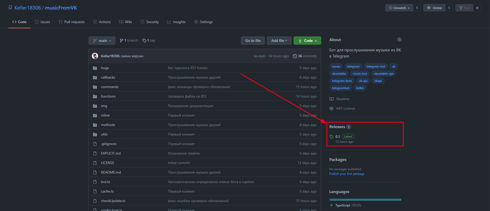
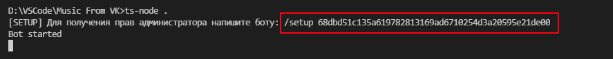
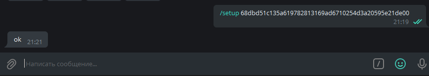
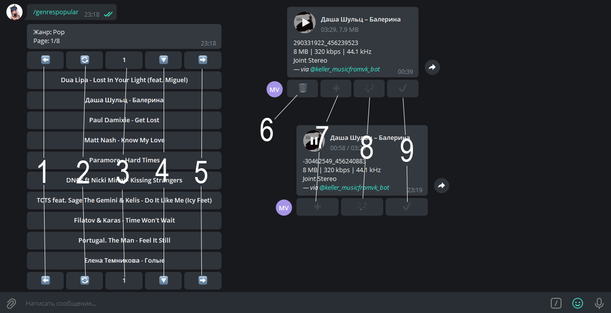
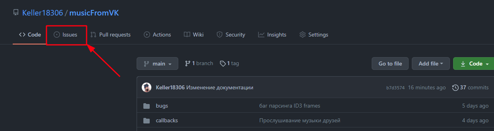

# Музыка из ВК в Telegram
Бот для прослушивания музыки из ВК в телеграм

1. [Предыстория](#Предыстория)
2. [Возможности](#Возможности)
3. [Установка](#Установка)
4. [Настройка](#Настройка)
5. [Запуск](#Запуск)
6. [Описание кнопок](#Описание-кнопок)
7. [Доступные группы](#Доступные-группы)
8. [Доступные команды](#Доступные-команды)
9. [Поддержка](#Поддержка)

## Предыстория
В мой тариф мобильного оператора входит безлимит на Telegram и безлимит на скорости 512 б/сек. Я заметил, что у Telegram скорость побольше, чем 512 б/сек. Слушать музыку из ВК не представлялось возможным из-за малой скорости. Так и появился этот бот.

## Возможности
1. Прослушивание музыки из `своей библиотеки`
3. Прослушивание музыки из `рекомендаций`
3. Прослушивание музыки из `недельного` и `дневного` плейлиса
4. Прослушивание `популярной` музыки
5. Прослушивание `новинок`
6. Управление своей библиотекой (`удаление` и `добавление`)
7. `Поиск` музыки
8. Дополнительные возможности (`решить пример`, безопасное `выполнение кода`)
9. **Полное** контролирование `прав для команд`
10. Распределение пользователей по `группам` (каждая группа имеет `свои права`)
11. Слушать музыку `друзей`

Планы на будущее:
- [ ] Поиск похожих треков по выбранному
- [ ] Пофиксить баг парсинга битрейта и остальной информации о аудио
    - [ ] Поддержка ID3v1
    - [ ] Поддержка ID3v2
        - [X] Заголовок сверху
        - [X] Дополнительный заголовок сверху
        - [X] Фреймы
        - [ ] padding
        - [ ] footer
    - [ ] Поддержка "голого" mp3 без ID3
- [X] Загрузка музыки в telegram напрямую через MTProto
- [ ] Команда выдачи определённого разрешения пользователю
- [ ] Пофиксить баг, что страница поиска перестаёт работать после перезагрузки бота
- [ ] Кэшировать рекомендации (при смене страницы каждый раз новое сейчас получается)
- [ ] Загрузить видео по ID из вк в тг
- [ ] Загрузить видео по URL в тг
- [ ] Прослушивание музыки из других плейлистов
- [ ] Авто отчиска кэша
- [ ] Рефакторинг кода

## Установка
Скачать последний релиз с github: 

Или же командой через git (вместо !VERSION! указать последнюю версию из релизов):
```bash
git clone --branch !VERSION! https://github.com/Keller18306/musicFromVK.git
```

Скачать необходимые модули:
```bash
npm i
```

Скачать TypeScript Node:
```bash
npm i -g ts-node
```

## Настройка
Нужно создать файл config.ts в корневой директории проекта с содержимым:
```typescript
import { Config } from './config.type'

export const config: Config = {
    api_id: 1234567, //API Id приложения MTProto
    api_hash: '826dbdaa1540d406ae3090add1805794', //API Hash приложения MTProto
    tg_token: '1234567890:3KojcGP79eGW44UffUtf8Zabt_9ui7pOY80', //Токен от телеграм бота
    vk_token: '6be59d30e6b346f17c4ca695df004f228379b78c261b0468b55da6f6dbfff5468beffa5c1dae4c0009ffa' //Токен от аккаунта вк
}
```
Получить данные для MTProto можно тут: https://my.telegram.org/

Получить токен для бота телеграм можно тут: https://t.me/BotFather

Получить токен от вк можно тут: https://oauth.vk.com/authorize?client_id=6121396&scope=327710&redirect_uri=https://oauth.vk.com/blank.html&display=page&response_type=token&revoke=1

## Запуск
Запустить бота можно следующей командой
```bash
ts-node .
```

Во время первого запуска в консоли будет выведено сообщение о настройке. Вам необходимо скопировать данную команду и отправить боту, чтобы вы получили полные права.



> Данная команда будет работать для всех пользователей, пока бот не будет перезагружен.

## Описание кнопок


### Список музыки
```
1 - Страница назад
2 - Обновить страницу
3 - Текущий номер страницы
4 - Получить все песни из страницы
5 - Страница вперёд
```
### Аудиофайл
```
6 - Удалить из "моей музыки"
7 - Добавить в "мою музыку"
8 - Открыть похожую музыку
9 - Отправить событие о прослушивании (вероятнее всего вк это использует для формирования рекомендаций)
```

## Доступные группы
| Группа | Разрешения | Описание |
|--------|------------|----------|
| guest  |bot.base.commands|Группа выдаётся всем, кто пишет боту (для экономии места автоматически в файл не заносится)|
| member |`всех групп выше` + bot.get.playlist, bot.search.music, bot.get.recommendations, bot.get.audio, bot.get.popular|Группа имеет доступ к прослушиванию музыки|
| owner  |`всех групп выше` + bot.get.music, bot.add.to.music, bot.send.start.event, bot.delete.music, bot.get.page, bot.get.friends|Группа имеет доступ к редактировании музыки и различным взаимодейтсвием с аккаунтом|
| admin  |`всех групп выше` + bot.eval, bot.debug, bot.add.admin, bot.exec.js, bot.set.group|Полный доступ ко всем командам|

## Доступные команды

|      ID     |   Команда | Минимальная группа  | Разрешение |    Описание    |
|-------------|-----------|---------------------|------------|----------------|
|start|/start|guest|bot.base.commands|Открыть клавиатуру|
|getId|/id|guest|bot.base.commands|Получает id текущего аккаунта|
|math|/math|guest|bot.base.commands|Посчитать пример|
|ping|/ping|guest|bot.base.commands|Проверяет работоспособноть бота и задержки к серверам Telegram|
|checkUpdate|/checkUpdate|guest|bot.base.commands|Проверяет наличие новой версии бота|
|setup|/setup|guest|bot.base.commands|Первоначальная настройка прав администратора|
|myPermissions|/myPermissions|guest|bot.base.commands|Узнать ваши текущие права|
|getMyCmds|/help|guest|bot.base.commands|Узнать доступные вам команды|
|myGroup|/myGroup|guest|bot.base.commands|Узнать вашу текущую группу|
|getCmdPerms|/getCmdPerms|guest|bot.base.commands|Узнать все команды и разрешения к ним|
|getGroup|/getGroup|guest|bot.base.commands|Узнать разрешения группы|
|getGroups|/getGroups|guest|bot.base.commands|Узнать все группы|
|getPerms|/getPerms|guest|bot.base.commands|Узнать все разрешения|
|dailyPlaylist|/getDaily|member|bot.get.playlist|Получает дневной плейлист с аккаунта|
|weekPlaylist|/getWeek|member|bot.get.playlist|Получает недельный плейлист с аккаунта|
|newPlaylist|/getNew|member|bot.get.playlist|Получает плейлист с новинками с аккаунта|
|getRecommendations|/getRecommendations|member|bot.get.recommendations|Получает рекомендации с аккаунта|
|getPopular|/getPopular|member|bot.get.popular|Получает популярную музыку|
|genresPopular|/genresPopular|member|bot.get.popular|Получает жанры популярной музыки|
|searchMusic|/search|member|bot.search.music|Поиск музыки в вк|
|getMusic|/getMusic|owner|bot.get.music|Получает всю музыку с аккаунта|
|getFriends|/getFriends|owner|bot.get.friends|Возвращает список друзей (есть возможность слушать их музыку)|
|setGroup|/setGroup|admin|bot.set.group|Установить группу человеку|
|eval|/eval|admin|bot.eval|Выполнение js кода в боте|
|execJs|/js|admin|bot.exec.js|Выполнение js кода|
|removeKeyboard|/removeKeyboard|admin|bot.debug|Удаляет клавиатуру|
|test|/test|admin|bot.debug|Тестовая команда|

## Поддержка
Баг? Проблема? Вопрос? - не бойтесь открывать issue по любому поводу!

